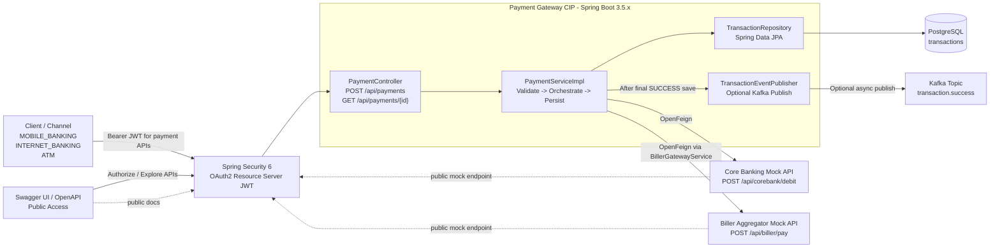

# Architecture Diagram

```mermaid
flowchart LR
    Client["Client / Channel<br/>MOBILE_BANKING<br/>INTERNET_BANKING<br/>ATM"]
    Swagger["Swagger UI / OpenAPI<br/>Public Access"]
    Security["Spring Security 6<br/>OAuth2 Resource Server JWT"]

    subgraph PG["Payment Gateway CIP - Spring Boot 3.5.x"]
        Controller["PaymentController<br/>POST /api/payments<br/>GET /api/payments/{id}"]
        Service["PaymentServiceImpl<br/>Validate -> Orchestrate -> Persist"]
        Repo["TransactionRepository<br/>Spring Data JPA"]
        EventPublisher["TransactionEventPublisher<br/>Optional Kafka Publish"]
    end

    CoreBank["Core Banking Mock API<br/>POST /api/corebank/debit"]
    Biller["Biller Aggregator Mock API<br/>POST /api/biller/pay"]
    DB[("PostgreSQL<br/>transactions")]
    Kafka["Kafka Topic<br/>transaction.success"]

    Client -->|"Bearer JWT for payment APIs"| Security
    Swagger -->|"Authorize / Explore APIs"| Security
    Security --> Controller
    Controller --> Service
    Service --> Repo
    Repo --> DB
    Service -->|"OpenFeign"| CoreBank
    Service -->|"OpenFeign via BillerGatewayService"| Biller
    Service -->|"After final SUCCESS save"| EventPublisher
    EventPublisher -->|"Optional async publish"| Kafka

    CoreBank -. public mock endpoint .-> Security
    Biller -. public mock endpoint .-> Security
    Swagger -. public docs .-> Security
```
