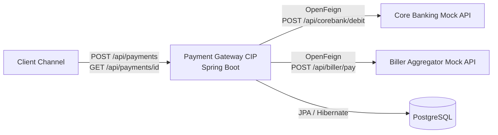

# Architecture Diagram

```mermaid
flowchart LR
    Client["Client Channel"]
    PG["Payment Gateway CIP<br/>Spring Boot"]
    CB["Core Banking Mock API"]
    BA["Biller Aggregator Mock API"]
    DB[("PostgreSQL")]

    Client -->|"POST /api/payments<br/>GET /api/payments/id"| PG
    PG -->|"OpenFeign<br/>POST /api/corebank/debit"| CB
    PG -->|"OpenFeign<br/>POST /api/biller/pay"| BA
    PG -->|"JPA / Hibernate"| DB
```
