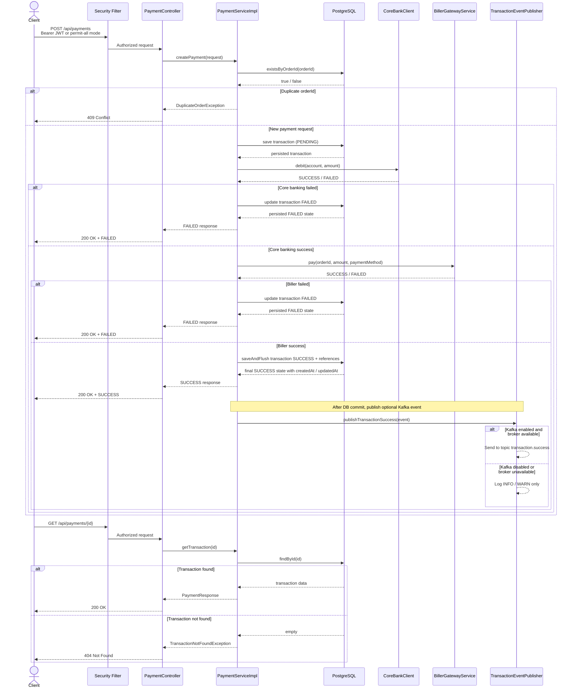

# Sequence Diagram

```mermaid
sequenceDiagram
    actor Client
    participant Security as Security Filter
    participant Controller as PaymentController
    participant Service as PaymentServiceImpl
    participant DB as PostgreSQL
    participant CoreBank as CoreBankClient
    participant Biller as BillerGatewayService
    participant Kafka as TransactionEventPublisher

    Client->>Security: POST /api/payments<br/>Bearer JWT or permit-all mode
    Security->>Controller: Authorized request
    Controller->>Service: createPayment(request)

    Service->>DB: existsByOrderId(orderId)
    DB-->>Service: true / false

    alt Duplicate orderId
        Service-->>Controller: DuplicateOrderException
        Controller-->>Client: 409 Conflict
    else New payment request
        Service->>DB: save transaction (PENDING)
        DB-->>Service: persisted transaction

        Service->>CoreBank: debit(account, amount)
        CoreBank-->>Service: SUCCESS / FAILED

        alt Core banking failed
            Service->>DB: update transaction FAILED
            DB-->>Service: persisted FAILED state
            Service-->>Controller: FAILED response
            Controller-->>Client: 200 OK + FAILED
        else Core banking success
            Service->>Biller: pay(orderId, amount, paymentMethod)
            Biller-->>Service: SUCCESS / FAILED

            alt Biller failed
                Service->>DB: update transaction FAILED
                DB-->>Service: persisted FAILED state
                Service-->>Controller: FAILED response
                Controller-->>Client: 200 OK + FAILED
            else Biller success
                Service->>DB: saveAndFlush transaction SUCCESS + references
                DB-->>Service: final SUCCESS state with createdAt / updatedAt
                Service-->>Controller: SUCCESS response
                Controller-->>Client: 200 OK + SUCCESS

                Note over Service,Kafka: After DB commit, publish optional Kafka event
                Service->>Kafka: publishTransactionSuccess(event)

                alt Kafka enabled and broker available
                    Kafka-->>Kafka: Send to topic transaction.success
                else Kafka disabled or broker unavailable
                    Kafka-->>Kafka: Log INFO / WARN only
                end
            end
        end
    end

    Client->>Security: GET /api/payments/{id}
    Security->>Controller: Authorized request
    Controller->>Service: getTransaction(id)
    Service->>DB: findById(id)

    alt Transaction found
        DB-->>Service: transaction data
        Service-->>Controller: PaymentResponse
        Controller-->>Client: 200 OK
    else Transaction not found
        DB-->>Service: empty
        Service-->>Controller: TransactionNotFoundException
        Controller-->>Client: 404 Not Found
    end
```
