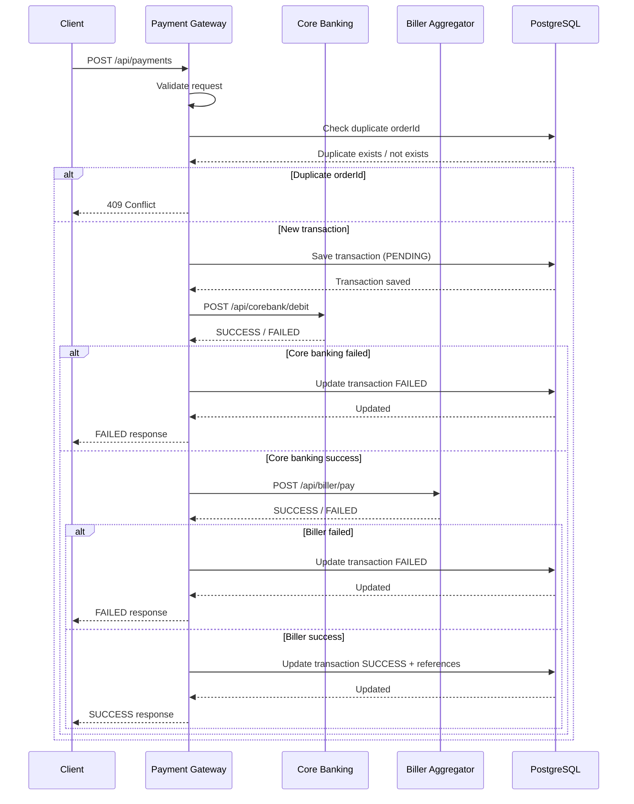

# Sequence Diagram

```mermaid
sequenceDiagram
    participant Client
    participant PaymentGateway as Payment Gateway
    participant CoreBank as Core Banking
    participant Biller as Biller Aggregator
    participant DB as PostgreSQL

    Client->>PaymentGateway: POST /api/payments
    PaymentGateway->>PaymentGateway: Validate request
    PaymentGateway->>DB: Check duplicate orderId
    DB-->>PaymentGateway: Duplicate exists / not exists

    alt Duplicate orderId
        PaymentGateway-->>Client: 409 Conflict
    else New transaction
        PaymentGateway->>DB: Save transaction (PENDING)
        DB-->>PaymentGateway: Transaction saved

        PaymentGateway->>CoreBank: POST /api/corebank/debit
        CoreBank-->>PaymentGateway: SUCCESS / FAILED

        alt Core banking failed
            PaymentGateway->>DB: Update transaction FAILED
            DB-->>PaymentGateway: Updated
            PaymentGateway-->>Client: FAILED response
        else Core banking success
            PaymentGateway->>Biller: POST /api/biller/pay
            Biller-->>PaymentGateway: SUCCESS / FAILED

            alt Biller failed
                PaymentGateway->>DB: Update transaction FAILED
                DB-->>PaymentGateway: Updated
                PaymentGateway-->>Client: FAILED response
            else Biller success
                PaymentGateway->>DB: Update transaction SUCCESS + references
                DB-->>PaymentGateway: Updated
                PaymentGateway-->>Client: SUCCESS response
            end
        end
    end
```
